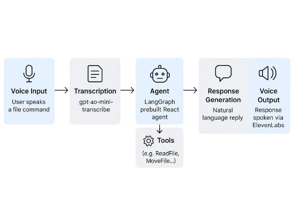

# Voice File Agent

A voice-controlled file management agent that lets you manage your files using natural language voice commands. Built with LangGraph, OpenAI, and ElevenLabs.

## Features

- Voice input for natural language commands
- Intelligent file management using LangGraph's ReAct agent
- Voice feedback using ElevenLabs
- Supports common file operations (e.g read files, copy, delete...)

## Architecture

The agent follows a modular pipeline:

1. **Voice Input** – Audio is captured from your microphone
2. **Transcription** – Audio is converted to text using OpenAI's gpt-4o-mini-transcribe
3. **LangGraph Agent** – The prebuilt React agent interprets the command
4. **File Tools** – One of the tools is selected to perform the action
5. **Text Response** – The agent generates a natural language reply
6. **Voice Output** – The response is spoken using ElevenLabs



## Getting Started

### Installation

1. Clone the repository:
```bash
git clone https://github.com/your-username/voice-file-agent.git
cd voice-file-agent
```

2. Install dependencies using Poetry:
```bash
poetry install
```

3. Create a `.env` file in the project root:
```env
OPENAI_API_KEY="your-openai-api-key"
ELEVENLABS_API_KEY="your-elevenlabs-api-key"
```

## Usage

1. Start the agent:
```bash
poetry run python main.py
```

2. Wait for the welcome message:
```
╭─────────────────── Welcome ───────────────────╮
│ 🎙️ Voice Agent is ready! Press Ctrl+C to exit. │
╰───────────────────────────────────────────────╯
```

3. Speak your command when prompted. For example:
   - "List all files in the current directory"
   - "Create a new file called notes.txt"
   - "Read the contents of config.json"
   - "Move file.txt to the backup folder"
   - "Delete old_document.pdf"

4. Press Enter to stop recording your command.

5. The agent will:
   - Process your command
   - Show the transcribed text
   - Execute the requested file operation
   - Speak back the result

6. To exit the agent, press Ctrl+C.

## Example Commands

Here are some example voice commands you can try:

- "Show me what's in this folder"
- "Create a new file called todo.txt with the text 'Buy groceries'"
- "Read the contents of config.json"
- "Copy important.pdf to the backup folder"
- "Move old_document.txt to the archive folder"
- "Delete temporary.txt"
- "Search for all PDF files in this directory"

## Configuration

The agent's behavior can be customized by modifying `core/config.py`:

- Voice settings (stability, similarity, style)
- Sample rate for audio recording
- Voice ID for ElevenLabs
- Model settings
- CLI theme and colors

## Contributing

Contributions are welcome! Please feel free to submit a Pull Request.

